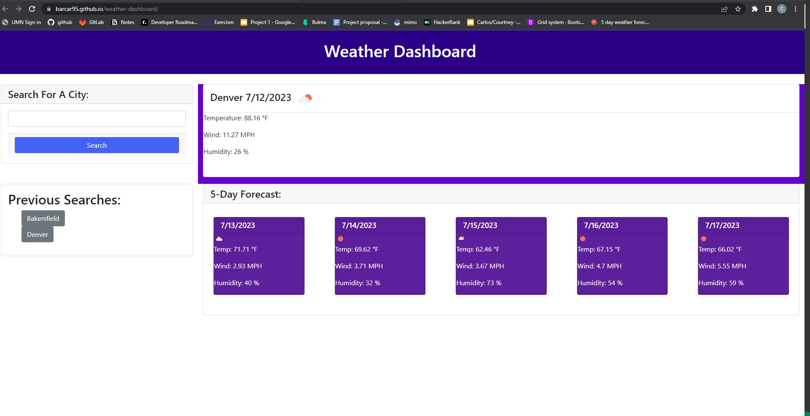

# Weather Dashboard

## Description

This Weather Dashboard allows users to access weather API data via a simple search to view current weather along with a 5 day forecast. The webpage also saves previous searches for user convenience.

## Installation

N/A

## Usage

The user will click the button that says "Generate Password" and windows will prompt the user to choose the criteria for the password. If the password length is not between 8 and 128 characters, an error message will prompt instead. Once the criteria is defined, a function, for loop, and method will generate the password on the screen.

The user will search a city name which will trigger the first api function call and the output will be the searched city's coordinates. Those coordinates will then be plugged in to the second api function and weather data will be displayed on screen. Each searched city, along with its weather data will be saved in local storage and conveniently displayed below the search bar as individual buttons.

[Weather Dashboard Webpage](https://barcar95.github.io/weather-dashboard/)

## Credits

N/A

## License

Please refer to the LICENSE in the repo.
